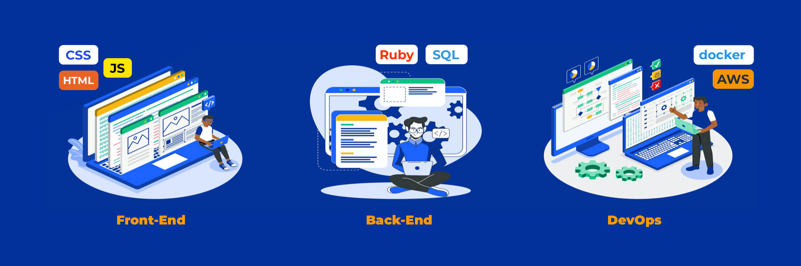

  

# Developer Roadmap 🧗

This document describes my current status and upcoming development milestones as a Software Engineer in 2021

<h2 align="center"><strong>Milestone Summary</strong></h2>

🚀 **OPEN** &nbsp;&nbsp; 📉 &nbsp;&nbsp;**6 / 7** goals completed **(90%)** &nbsp;&nbsp;📅 &nbsp;&nbsp;**Tue Aug 31 2021**

| Status | Milestone                                     | Goals |   ETA (240h)   |
| :----: | :-------------------------------------------- | :---: | :------------: |
|   ✅   | [GitHub Actions](#github-actions)             | 3 / 3 |   Apr 2021     |
|   ✅   | [Ruby under the hood](#ruby-in-depth)         | 6 / 6 |   May 2021     |
|   ✅   | [Is Ruby on Rails Dead?](#is-ror-dead)        | 9 / 9 |   Jun 2021     |
|   ✅   | [AWS Basics](#aws-basics)                     | 4 / 4 |   Jul 2021     |
|   🚧   | [Boring Front and End](#boring-front-and-end) | 0 / 1 |   Aug 2021     |
|   ✅   | [Personal development](#personal-development) | 2 / 4 |   2h / week    |
|   🚧   | [Google Cloud](#google-cloud)                 | 1 / 4 |                |
|   ✅   | [Light talk](#light-talk)                     |   1   |      Aug       |

<h2 align="center"><strong>Stage #️⃣1️⃣</strong></h2>

## GitHub Actions

Helps to automate software workflow with world-class CI/CD in Linux, macOS, Windows, ARM and containers.
Provide live logs for easy find bugs and vulnerability. Has a lot of open source libraries for help to manage workflow.

- [x] Continuous Integration (CI) and Continuous Delivery (CD) concepts
- [x] Concepts of cache and containers
- [x] Setup CI for RoR project(with PostgreSQL, RSpec, Capybara, Webpacker)

<b>Resources:</b>

 

> [GitHub Action](https://docs.gitlab.com/ee/ci/introduction)  
> [Go Rails video](https://www.youtube.com/watch?v=gGUXydw22zw&ab_channel=GoRails)  
> [GitHub CI and CD to Firebase](https://www.youtube.com/watch?v=eB0nUzAI7M8&ab_channel=Fireship)  
> [Integration with Asana](https://github.com/marketplace/actions/asana-github-actions)  
> [Deploy to Heroku](https://github.com/marketplace/actions/deploy-to-heroku)  
> [Ruby on Rails project with customized Github CI](https://github.com/Synkevych/money_spent_counter)

## Ruby in depth

- [x] Rack on Ruby
- [x] DSL in Ruby
- [x] Data Structures 💖
- [x] Include, extend, prepend and difference between them
- [x] Metaprogramming what it is and how to use it
- [x] SOLID, GRASP, YAGNI, KISS, DRY etc

<b>Resources:</b>

 

> [How to use Rack Middlewares](https://guides.rubyonrails.org/rails_on_rack.html)  
> [Ruby data structures](https://www.rubyguides.com/2019/04/ruby-data-structures)  
> [What is Rack](https://github.com/Synkevych/job_interview_tasks/blob/master/Interview_8_BlackBird.md#what-is-rack)  

## Is RoR Dead?

To answer this question, I need to study in more detail the internal structure and all the charms of the RoR framework. Ruby on Rails is a tool that helps to quickly and efficiently implement the functionality that the customer wants. But like any tool, it can become a device that helps to do work more sophisticated and faster, or become a dangerous weapon. To understand the difference and also has some benefits: maintainability, readability, elegance, faster development, DRY code.

- [x] Naming variable and functions in programming
- [x] Global classes: Active Record, Active Job, Active Support, Active Cable, Active Storage, Action Mailer
- [x] Securing Sensitive Data(concepts and examples) 💖
- [x] RESTful API, REST vs GraphQL 💖
- [x] Authentication: JWT, OAuth 2.0
- [x] Caching with Rails  
- [x] SQL queries in Rails
- [x] Isolation (database systems)
- [x] Rails Concepts
- [x] Create simple application using Active Cable + Redis

<b>Resources:</b>

 

> [Naming things](https://gist.github.com/tmcw/35849b7e9b86bb0c125972b2bb275bc7)  
> [Чиcтый код - Роберт Мартин](https://habr.com/ru/post/424051)  
> [Securing Sensitive Data in Rails](https://ankane.org/sensitive-data-rails)  
> [Catching with Rails](http://rusrails.ru/caching-with-rails-an-overview)  
> [Rails Concerns](https://blog.appsignal.com/2020/09/16/rails-concers-to-concern-or-not-to-concern.html)  
> [Caching with Rails](https://guides.rubyonrails.org/caching_with_rails.html)
> [Уровни изолированности транзакций для самых маленьких](https://habr.com/ru/post/469415)
> [Realtime User Tracking](https://github.com/Synkevych/realtime_user_tracking)
  

## AWS Basics

Amazon Web Services launched in 2002 is the market leader in IaaS (Infrastructure-as-a-Service) and PaaS (Platform-as-a-Service) for cloud ecosystems, which can be combined to create a scalable cloud application without worrying about delays related to infrastructure provisioning (compute, storage, and network) and management.
With AWS you'll find a complete set of highly available services which is designed to work together to build sophisticated scalable application delivered over the internet.
You'll have on-demand access to highly durable storage, low-cost compute, high-performance databases and the tools to manage these resources all available with upfront costs only pay for what you use.

- [x] AWS Identity and Access Management (IAM)
- [x] Create different keys and folders
- [x] AWS Simple Storage Services (S3) 💖
- [x] Generate Access Keys and setup AWS S3 on Rails project

<b>Resources:</b>

 

> [AWS Basics for Beginners Full Course](https://www.youtube.com/watch?v=ulprqHHWlng&ab_channel=freeCodeCamp.org)  
> [AWS Certified Cloud Practitioner Study Guide](https://www.ebooks.com/en-ua/book/209700948/aws-certified-cloud-practitioner-study-guide/ben-piper/)
> [Projecto](http://ec2-3-129-9-9.us-east-2.compute.amazonaws.com)

## Boring Front and End

- [ ] Pass interview as a Junior Fronted Developer

### Content for repeat

- WebSocket, HTTP, HTTPs, ftp, ssh
- Currying and Composition
- Promises, Async/Await, XMLHttpRequest, Yeld Function
- Closures(local, global, block) and Scopes
- Rest operator, Spread operator
- React lifecycle methods
- Error objects in JS
- 3 different types of inheritance
- bind, apply, call methods
- CORS

<b>Resources:</b>

 

> [Job Interview Tasks](https://github.com/Synkevych/job_interview_tasks)  
> [You dont know JS](https://github.com/getify/You-Dont-Know-JS)  
> [freeCodeCamp open-source codebase](https://github.com/freeCodeCamp/freeCodeCamp)  
> [Basic info about React](https://github.com/Synkevych/job_interview_tasks/blob/master/JavaScript/React.md)  

## Personal development

Focus on work, identifying my most productive hours throughout the day, and completing my most important tasks during those hours. Correct formulation of the problem and look at the problem from different angles, rethinking the task. Breaking the task down into small parts and setting the correct priorities for their implementation.

- [x] See tasks differently and think outside the box
- [x] Develop the ability to focus on one task
- [x] Become a better Stack Overflow user
- [x] Estimating task execution time

<b>Resources:</b>

 

> [The 7 Habits of Highly Effective People](https://www.yakaboo.ua/7-habits-of-highly-effective-people)  
> [Scrum. Навчись робити вдвічі більше за менший час](https://www.yakaboo.ua/scrum-navchis-robiti-vdvichi-bil-she-za-menshij-chas)  
> [Оценка времени выполения задачи](https://habr.com/ru/post/52472)  
> [Как способность фокусироваться на одной задаче может сделать вас продуктивнее](https://hype.tech/@id1728/kak-sposobnost-fokusirovatsya-na-odnoy-zadache-mozhet-sdelat-vas-produktivnee-8xk9i1zx)  
> [Гибкий ум. Как видеть вещи иначе и думать нестандартно](https://www.yakaboo.ua/gibkij-um-kak-videt-veschi-inache-i-dumat-nestandartno)  

## Google Cloud
(Google Cloud information)[v2/GoogleCloud.md]

### ⌨️ Typing Speed - 50wps

Typing on the keyboard should be like breathing - precise and fast at the right moments.  
Blind typing helps you focus on your work without thinking about the keys or looking at the keyboard. It will also help avoid spelling errors that are difficult to track down and not tracked in the IDE.

- en 🇺🇸
- uk 🇺🇦

> Resources:  
> [Typing Club](https://www.typingclub.com/sportal)

### 🌐 English - Intermidiate

English, English, English it is needed everywhere and one of the most important thing in this roadmap.

> Resources:  
> [Duolingo](https://www.duolingo.com/learn)  
> [Let's Master English with Coach Shane](.)

## Light talk [Presentation](https://docs.google.com/presentation/d/1T61sRWjAKVdSf6jlRJIaghVjSOiUqa8-wAnbWTd1uDI/edit?usp=sharing)

The main idea is to tell the audience something interesting from their own experience (for example, a hobby, a new technology, a previous trip) in 20-30 minutes. This presentation should not be very technical - so that it is interesting for all employees of the company.

### 🗣️ Presentation topic: **Linux is everywhere – Facts everyone should know**

What device are you reading this article on?

If it happens to be an Android smart device, you are using a machine running Linux at its core. The majority of web servers, including ours that is serving you this page, and cloud infrastructure are Linux-based as well. “So, what is Linux, some piece of internet software?” the uninitiated might ask.

Well, Linux isn’t found just in your smartphone or on the internet, it’s probably present in your car as well, be it an Audi, Honda, or Mercedes. Not impressed yet?

How about this – all of the world’s top 500 supercomputers use Linux as their OS. It also powers most of the software behind the US Department of Defense, Amazon, Instagram, and Wikipedia, to name just a few.

So, is Linux an operating system? Yes, Linux it is one of the most powerful operating systems in the world! And it powers much more of the global technology than most people give it credit for. Linux is clearly much more present in our lives than we realize, but it tends to get overshadowed by its bigger, older cousins Windows and Macintosh. As a result, relatively few people know much about it, and some have never even heard of it.

<b>Resources:</b>

 

> [111+ Linux Statistics and Facts – Linux Rocks!](https://hostingtribunal.com/blog/linux-statistics)  
> [Linux vs Unix – What’s the Difference?](https://www.plesk.com/blog/various/linux-vs-unix-whats-the-difference)  
> [What is Linux: Definition, History, Significance, Perks, and Pitfalls](https://hostingtribunal.com/blog/what-is-linux)

<h2 align="center"><strong>Stage #️⃣2️⃣</strong></h2>

## 🌱 Idea for the future milestones

Show all ideas

 

### 👨‍💻 Back-end

- Web Serves: Nginx, Apache 💖
- Docker and containerization strategy
- Message Brokers: RabbitMQ, Apache Kafka
- Search Engines: ElasticSearch, Solr, Sphinx
- GOF Design Patterns, Architectural Patterns, Different Testing techniques 💖

### 🧑‍🔧 DevOps

- OSI Model. TCP/IP/UDP Common ports 💖
- Knowledge about different file systems 💖
- Setting up a Reverse Proxy (Ngnix, ...)
- Setting up caching Server (Squid, Nginx, ...)
- Setting up a load balancer (HAProxy, Nginx, ...) 💖
- Setting up a firewall
- TLS, STARTTLS, SSL, HTTPS, SCP, SSH, SFTP
- Postmortem analysis when something bad happens

### Golang 🇬.🇴

Created by Google in 2009 Go programming language do what Google does: performant web applications at scale.
Go is the most powerful, performant, and scalable programming language today for creating web application, web API's, microservices and other distributed services.

> Resources:  
> [Udemy course] (https://www.udemy.com/course/go-programming-language)  
> [Golang web dev] (https://github.com/GoesToEleven/golang-web-dev)  

### 2022 FTL Roadmap September 2021 - February 2022

#### Ruby and Rails Stack
- GOF Design Patterns - book
- Docker in Rails application: dockerize some rails application
- ElasticSearch - deep dive

#### Other

- Web Serves Nginx: setup Nginx for some rails application
- RabbitMQ, Apache Kafka - read what it is and where you can use it
- OpenStack and Ansible
- Python - course: [CodeCademy](https://www.codecademy.com/courses/learn-python/lessons/strings--console-output/resume)
- Presentation: Web Serves vs Application Servers, Databases in 2022, What is postgraduation in Ukraine
  
> Resources:
> [Elasticsearch](https://www.udemy.com/course/elasticsearch-complete-guide)
> [Docker](https://www.udemy.com/course/docker-mastery)
> [GraphQL](https://www.udemy.com/course/draft/1456124/learn/lecture/8702302)

